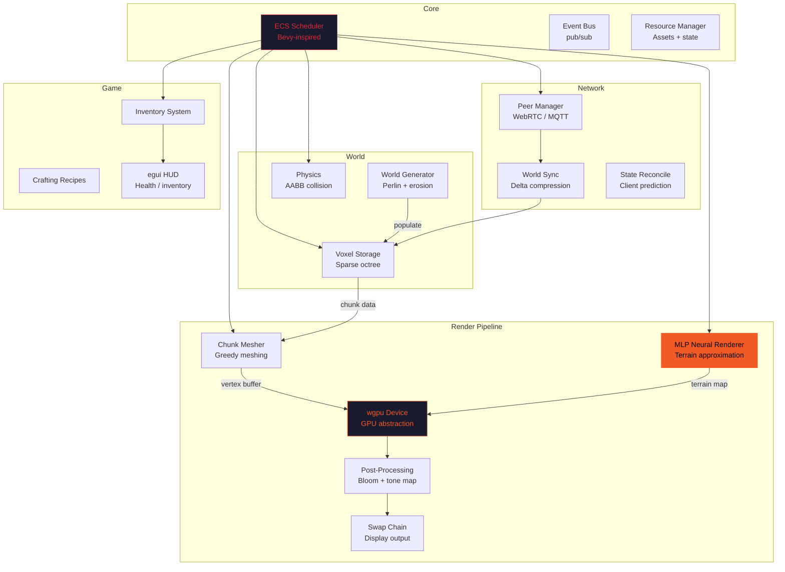
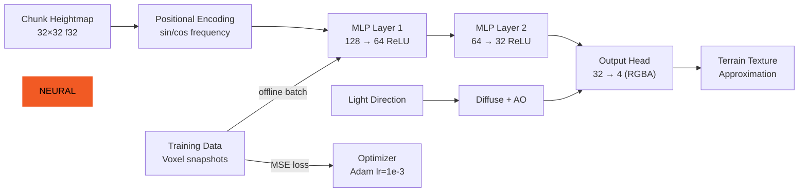
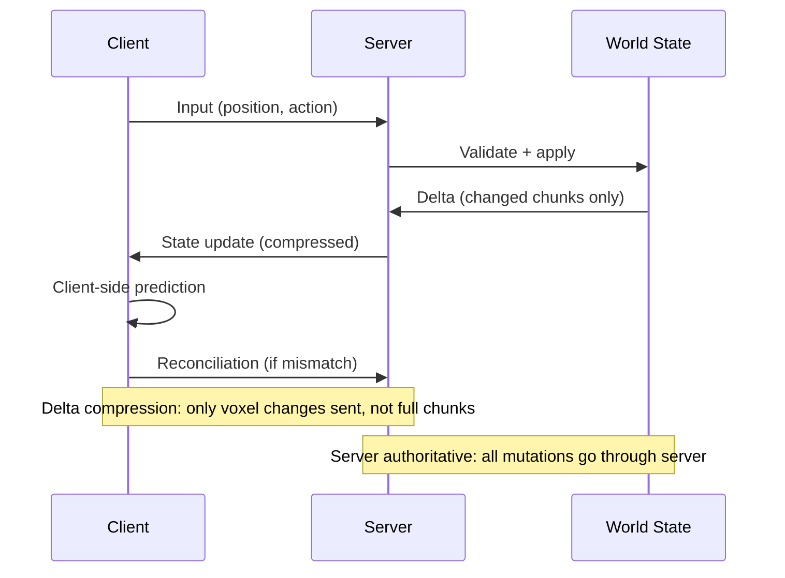

## Architecture

NV2 is a **native Rust voxel engine** with an MLP neural renderer, multiplayer, ECS gameplay, and a content pipeline. GPU-driven rendering via wgpu, chunked world with real-time meshing.

### Engine Pipeline



### Neural Renderer Detail



### Multiplayer Sync



## Quickstart

### One-liner — Build & run

```bash
git clone https://github.com/BartoszOsiej/NV2_ENGINE && cd NV2_ENGINE && cargo run --release
```

### One-liner — Run with debug rendering

```bash
git clone https://github.com/BartoszOsiej/NV2_ENGINE && cd NV2_ENGINE && NV2_DEBUG=1 cargo run --release
```

### One-liner — Docker (headless server mode)

```bash
docker run --rm -v "$(pwd)":/build -w /build \
  -e NV2_HEADLESS=1 \
  ghcr.io/bartoszosiej/nv2-ci:latest \
  cargo run --release -- --server --port 7777
```

### One-liner — Generate world + export

```bash
cd NV2_ENGINE && cargo run --release -- --generate --seed 42 --export world.nv2
```

### One-liner — Run benchmarks

```bash
cd NV2_ENGINE && cargo run --release -- --bench-mesh --bench-neural --bench-ecs 2>&1 | tee benchmarks.txt
```

### Verify

```bash
# Quick smoke test (builds + runs headless for 5 seconds)
cargo test && cargo run --release -- --headless --frames 300 --quit
```
