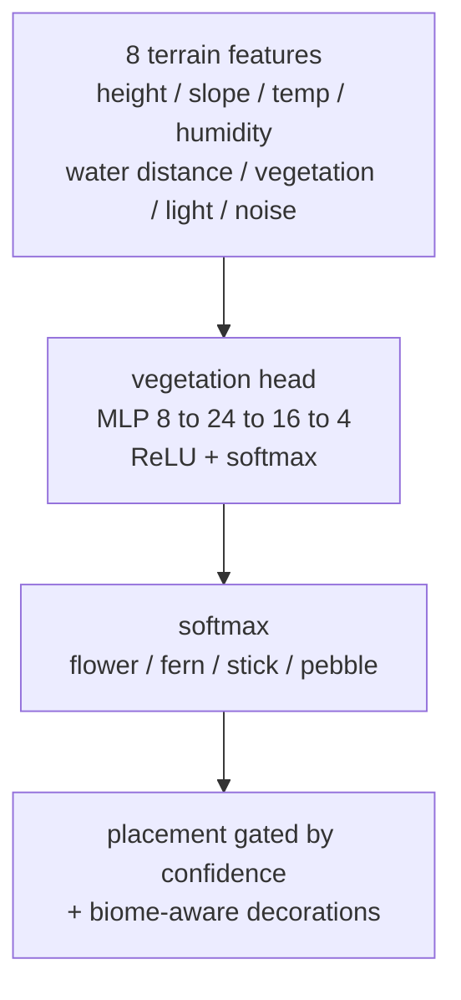

[](https://scorecard.dev/viewer/?uri=github.com/BartoszOsiej/NV2_ENGINE)

<div align="center">

[](https://crates.io/crates/nv2_engine)
[](https://github.com/BartoszOsiej/NV2_ENGINE/pkgs/container/nv2_engine)
[](https://github.com/BartoszOsiej/NV2_ENGINE/releases)
[](LICENSE)

**A native desktop voxel engine with AI-powered terrain generation.**

</div>

NV2 is a from-scratch voxel engine in Rust — real-time world rendering,
procedural terrain generation, interaction, inventory/crafting gameplay and
content-pipeline tools. A working gameplay loop: menus, commands, save/load,
item handling, block interaction, world simulation, GPU-driven rendering.

## 🎮 Demo


<!-- VHS auto-rendered — run: vhs demos/nv2.tape -->


## Quick start

```bash
cd Core
cargo run --release
```

What you'll see:

- The engine boots with no startup lag
- The world generates with AI-powered vegetation
- Flowers, ferns, pebbles placed intelligently by the neural network
- The AI learns in the background (no FPS impact)

## 🤖 MeMLP — the neural network inside the engine

The entire AI stack runs on **MeMLP** — a modular embedded neural network
living inside the engine (pure CPU, JSON checkpoints, no cloud, no GPU):



Modules — one checkpoint file, implemented in `Core/Src/world/memplp.rs`:

| Module | Shape | Task |
|---|---|---|
| `vegetation` | 8 → 24 → 16 → 4 | flower / fern / stick / pebble placement |
| `biome` | 8 → 12 → 9 | biome classification (9 biomes, drives decorations) |
| `texture` | 8 → 12 → 6 | procedural texture-style selection |

> [!TIP]
> **~1 KB checkpoint · ~0.3 µs per prediction · millions of training samples/s**
> on the background thread. Reproduce with:
> `cargo test --release qa_benchmark_report -- --ignored --nocapture`

- **22 vegetation types** — roses, tulips, daisies, water plants, moss, sticks, pebbles…
- **Learns from the player** — placing/breaking vegetation is recorded as training feedback (`Core/Src/world/ai_feedback.rs`)
- **Online learning** — real-world climate data (Open-Meteo) merged into training, graceful offline fallback
- **Backward compatible** — old single-hidden-layer checkpoints migrate automatically on load

<details>
<summary><b>🧱 Gameplay & NV2.0 release-state mechanics</b></summary>

- Block interaction (place / mine)
- Inventory and crafting (3×3 grid, NVCrafter)
- Commands, menus, save / load
- Chunk-based world simulation

**Survival systems (2026-08-14):**

- **Day/night cycle** — 10-minute days, wall-clock HUD, night darkens the sky
- **Health & hunger** — decay, regen, starvation, death + respawn at dawn
- **Hostiles** — night-spawning enemies that chase and attack; `/attack` to fight
- **Tool durability** — tools wear out and break; `/repair` fixes them
- **Progression** — achievements (`/achievements`) for surviving nights, kills…
- **HUD** — `☀ 14:00 | ♥ 20/20 | 🍗 100/100 | ☠ 0`

Commands: `/time`, `/day`, `/night`, `/eat`, `/heal`, `/attack`, `/tools`, `/repair`, `/achievements`, `/stats`.

**NV2.2 expansion (2026-08-25):**

- **10 new blocks** — Glass, Bricks, Terracotta, Bookshelf, Lantern, Campfire, Barrel, Anvil, Grindstone, Stonecutter
- **12 new tools** — Stone/Iron/Diamond/Netherite axe, shovel, sword with full crafting recipes
- **5 new items** — Gold Ingot, Diamond, Emerald, Redstone Dust, Charcoal
- **3 enemy types** — Zombie (standard), Skeleton (ranged), Spider (fast), Creeper (explosive) with biome-aware spawning
- **27 achievements** — survival, combat (per-enemy kills), mining, building, exploration
- **Particle system** — block break, combat hit, enemy death effects
- **New commands** — `/give <block> [count]`, `/weather <type>`, `/gamemode <mode>`, `/help`

</details>

<details>
<summary><b>🤖 Phase-2 features</b></summary>

- **Community model sharing** — `/ai_export <path> [author]` writes a portable `nv2-model-bundle`; `/ai_import <path>` loads any shared bundle
- **Training datasets** — `/ai_dataset <path> [epochs]` trains the vegetation head on JSON datasets with full validation
- **Player-preference learning** — the model tracks which vegetation you like placing and blends training targets toward that taste; `/ai_stats` shows live stats

Also: `/locate`, `/tp`.

</details>

## 🛠️ Tech stack

| Area | Technology |
|---|---|
| Engine & runtime | Rust (2021), wgpu 0.20, winit 0.30 |
| Content pipeline | C# / .NET 8 (`Bridge/Tools`) |
| Texture utilities | Python (`generate_textures.py`) |
| Rendering | GPU-driven renderer, Vulkan layers |

```
NV2_ENGINE/
├── Core/         Rust runtime: engine, gameplay, renderer, world sim, UI (wgpu, winit)
├── Bridge/       .NET 8 content tools: atlas slicing, asset preparation
├── Assets/       Resources and packaging
└── VulkanLayers/ Supporting Vulkan layers
```

> [!NOTE]
> The repository previously shipped ~3 700 Mojang/Minecraft texture files.
> They were removed and replaced with the engine's deterministic procedural
> texture generator — see [`ASSET_AUDIT.md`](ASSET_AUDIT.md) and [`ATTRIBUTION.md`](ATTRIBUTION.md).

<details>
<summary><b>📚 Documentation</b></summary>

| File | Content |
|---|---|
| `TECHNOLOGIES_AND_CURRENT_IMPLEMENTATION.md` | Solution overview and tech stack |
| `AI_IMPLEMENTATION_SUMMARY.md` | AI vegetation system summary |
| `AI_TECHNICAL_DOCS.md` | Neural network mathematics |
| `AI_PHASE2_ROADMAP.md` | Future plans (internet integration, GPU textures…) |
| `QUICKSTART.md` | Build & run instructions |
| `CHANGELOG.md` | What changed |

</details>

## 🚀 Roadmap

- [ ] Downloading training datasets
- [ ] GPU texture generation
- [ ] Real-time terrain editing
- [x] Community model sharing
- [x] Player preference learning

---

<div align="center">

**Part of [BartoszOsiej](https://github.com/BartoszOsiej)'s systems toolkit** · [`halcyon`](https://github.com/BartoszOsiej/halcyon-process-monitor) · [`externum`](https://github.com/BartoszOsiej/externum) · [`AURORA-OS`](https://github.com/BartoszOsiej/AURORA-OS)

MIT © 2026 Bartosz Osiej

</div>
